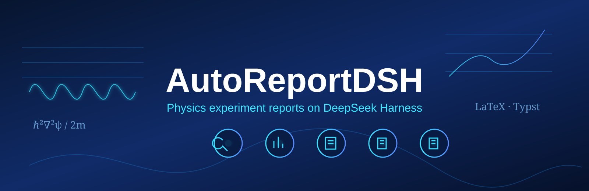

<p align="center">
  
</p>

<p align="center">
  A fixed-team physics-experiment report workflow for <a href="https://github.com/deepseek-ai/deepseek-harness">DeepSeek Harness</a>.
</p>

<p align="center">
  
  
  
  
  
</p>

<p align="center">
  English | <a href="README.zh.md">中文</a>
</p>

> **Developer preview.** AutoReportDSH is source-installable and fully covered by keyless integration tests. The npm/DSH-bundle release flow described below is planned but **not published yet**.

AutoReportDSH migrates the report-domain behavior of [AutoReportCLI](../autoreportcli) into a DeepSeek Harness (`dsh`) plugin. DSH owns the generic runtime—agent loop, sessions, compaction, providers, tools, subprocess lifecycle, approvals, sandbox, and UI. AutoReportDSH owns the report workflow—fixed roles, durable delegation state, role writable roots, resources, compilation skills, and artifacts.

The detailed design and implementation record live in [PLAN.md](PLAN.md).

## What it does

Selecting the opt-in **`autoreport`** agent preset enables one fixed team:

| Role | Responsibility | Writable location |
|---|---|---|
| MAIN | Scope audit, dependency tracking, delegation, user-facing progress | `Outline/` |
| THEORY | Derivations, assumptions, reusable formulas | `Theory/` |
| DATA_ANALYSIS | Process raw measurements and quantitative results | `Data/Processed/` |
| PLOTTING | Plot scripts and figures | `Plots/` |
| REPORT | LaTeX/Typst sources and report compilation | `Report/` |

The model uses DSH-native `read` / `write` / `edit` / `bash` / `skill` primitives (search via `rg`/`find` in bash). AutoReport-specific MAIN tools are deliberately small:

```text
send_to_agent     fixed-role delegation with durable task/revision tracking
ask_user_question DSH-native structured questions for requirement gaps
```

Specialist children are DSH continuable sessions. They keep role context across follow-ups and report structured outcomes through `report_workflow`. A direct human conversation with a specialist remains ordinary conversation; it does not create or complete a workflow task without an active delegation context.

AutoReport-owned skills are role-scoped: MAIN receives `pdf-reference-reader` (MinerU / mineru-open-api) for References PDF extraction into `Outline/.cache/mineru/`; REPORT receives `experiment-report-writer` plus the active language compile skill (`latex-compile` or `typst-compile`) through progressive disclosure; THEORY, DATA_ANALYSIS, and PLOTTING receive none of these domain skills. Experiment `References/skills` is a cwd-sensitive DSH skill root. DSH user/project skills retain their normal DSH visibility.

## Coexistence with normal DSH

Installing the overlay does **not** convert every DSH session into AutoReport:

```text
standard           normal DSH behavior
autoreport    AutoReport physics-report workflow
```

Only a top-level session whose effective preset is `autoreport` enters the AutoReport runtime. Ordinary sessions retain their stock shell, filesystem behavior, child-report tool, and workspace. This is covered by the integration suite.

## Installation

**Now:** install from source (this section). That is the only supported path.

**Later:** after the package is published, install with `dsh plugin add` from npm. Those commands are listed under [Planned npm / DSH bundle release](#planned-npm--dsh-bundle-release) and are **not available yet**.

## Run from source

The two repositories must be sibling directories: development `package.json` uses `link:` entries into the local harness checkout.

### Prerequisites

- Node.js `22.19+` or `24+`
- Corepack-enabled pnpm
- A local DeepSeek Harness checkout at the pin in [docs/dependencies.md](docs/dependencies.md), with the two patches in `patches/` applied
- DSH-native bash and workspace-write sandbox (macOS Seatbelt, Linux bwrap/Landlock, Windows ACL)

### 1. Check out both repositories as siblings

```sh
cd /path/to/your/development-directory

git clone https://github.com/deepseek-ai/deepseek-harness.git deepseek-harness
git clone https://github.com/xjsongphy/AutoReportDSH.git AutoReportDSH
```

### 2. Patch and build DeepSeek Harness

Until DSH itself ships `Session.append(..., { ignorable: true })` and per-session `sandbox/workspace-root`, apply the same patches CI uses (see [docs/dependencies.md](docs/dependencies.md)):

```sh
cd deepseek-harness
git checkout <DSH_REF from docs/dependencies.md>
git apply ../AutoReportDSH/patches/deepseek-harness-ignorable-append.patch
git apply ../AutoReportDSH/patches/deepseek-harness-sandbox-workspace-root.patch
corepack enable
pnpm install
pnpm run build
```

A published `@deepseek-ai/dsh` CLI on PATH is not a substitute for this patched checkout until those APIs are in the released DSH version.

### 3. Install, test, and build AutoReportDSH

```sh
cd ../AutoReportDSH

pnpm install
pnpm test
pnpm run build
```

The keyless suite validates workflow persistence, preset membership, role writable roots, report resources, artifact manifests, and real Loader boot behavior. `tests/eval/workflow-eval.test.ts` drives the eight assembled workflow traces (LaTeX/Typst pipelines, blocked recovery, forgotten `report_workflow`, cold rebind, artifact `modified`, Python snapshot, coexistence).

### Refresh externally maintained skills

Runtime plugin start incrementally syncs listed remotes into **`$DSH_HOME/autoreport/resources`** (the DSH analog of AutoReportCLI's `~/.autoreport`). Git blob ids decide the pull: only files whose blob changed are downloaded. A missing remote path or a failed fetch keeps the last overlay copy. Those files are **not** committed to this repository.

`pnpm run sync:resources` performs the same refresh without booting DSH. The live list covers AutoReportCLI remotes that still exist, except cc-switch (DSH owns providers) and the frozen `experiment-report-writer` projection. Typst keeps only `SKILL.md` plus basics/styling/tables/academic. Bundled (git-tracked) skills stay under `resources/skills/`.

### 4. Install the AutoReport preset

```sh
pnpm run install:preset
```

This writes the rendered user preset to:

```text
$DSH_HOME/.agent-presets/autoreport/   # default home is ~/.dsh
```

links the package at `$DSH_HOME/profiles/node_modules/autoreportdsh` so the web client can load the settings card, and writes `cordis.overlay.generated.yml` in this repository. The installer overwrites AutoReport-owned preset files and keeps unrelated files under the user preset directory. A leftover `$DSH_HOME/.agent-presets/autoreport-main/` from the preset-id rename is retired after the new directory is written (foreign files that the new install does not already own are copied across). Sessions saved under `autoreport-main` still count as AutoReport. To replace a stale install completely, delete `$DSH_HOME/.agent-presets/autoreport/` first, then rerun.

For an isolated harness home:

```sh
DSH_HOME=/tmp/autoreport-dsh-home \
  pnpm run install:preset -- --home "$DSH_HOME"
```

Plain `dsh web` does **not** load AutoReport. The overlay is not part of the stock web/headless profile; pass `--patch` every time you boot.

### 5. Start the local harness with the overlay

Boot the **patched sibling** harness (required until the two APIs above are in a DSH release):

```sh
cd ../deepseek-harness

pnpm dsh web \
  --port 3081 \
  --patch ../AutoReportDSH/cordis.overlay.generated.yml
```

Open `http://127.0.0.1:3081`, create a session, and select **`autoreport`**. Report-workflow defaults are under **Settings → Plugins → Plugin configuration → AutoReport**. Use another port when an existing DSH Web server already occupies the default `3080`.

If a global `dsh` is already on PATH (`npm i -g @deepseek-ai/dsh`), the same overlay flag works only when that CLI is new enough to include the two APIs. Until then, use `pnpm dsh` from the patched sibling checkout, not the global binary:

```sh
dsh web --port 3081 --patch /absolute/path/to/AutoReportDSH/cordis.overlay.generated.yml
```

For a one-shot harness profile:

```sh
pnpm dsh headless \
  --patch ../AutoReportDSH/cordis.overlay.generated.yml \
  "Create an outline for this experiment workspace"
```

## First report workflow

After selecting `autoreport`, initialize the workspace explicitly or let the first admitted MAIN workflow turn initialize it idempotently:

```text
/report-init
/report-init --language latex
/report-init --language typst
```

`/report-init` creates the required directories and materializes only missing resources. It never overwrites user files. LaTeX and Typst sources may coexist; the project setting chooses the active report language.

```text
Data/
├── Processed/
References/
Theory/
Plots/
├── Fig/
└── Scripts/
Report/
Outline/
```

A typical MAIN request is then simply:

```text
Review the experiment files, create the report tasks, and produce a first report draft.
```

MAIN delegates bounded work through `send_to_agent`; specialists read the shared workspace and report their durable outcome back to MAIN.

## Configuration

DSH owns all model/provider and credential configuration; AutoReportDSH only uses the model routes configured in DSH and does not maintain its own provider system.

AutoReportDSH owns report-workflow settings. A new workflow snapshots its values in this order:

```text
project settings     <dshHome>/autoreport/<workspaceId>/project.json
        ↓
DSH user settings    namespace: autoreport
        ↓
composition defaults
        ↓
schema defaults
```

The resolved snapshot is committed to the durable `autoreport/workflow` event. Changing settings later does not change an in-flight report. The resolver retains an internal workflow-override seam for future structured commands, but v1 intentionally has no user-facing override.

Current composition defaults include:

```text
defaultReportLanguage   latex
specialistModel         inherit Main (optional cordis/project route; switch live in the conversation window)
delegationWaitTimeoutMs 600000
pythonExecutable        optional; AutoReport-managed venv (`__managed__` → `$DSH_HOME/autoreport/venv`), a detected local interpreter, or a custom absolute path
```

The `autoreport` user-settings namespace is registered through `@deepseek-ai/dsh-settings`; it persists and validates `defaultReportLanguage`, `delegationWaitTimeoutMs`, and optional `pythonExecutable`. The web settings card lives under **Settings → Plugins → Plugin configuration**. Changing those values does not alter a report that is already running. Worker model, provider, and reasoning effort are not edited on that card: add providers under **Settings → Models**, then switch a running worker from its conversation window using DSH's model picker (`session.models` / `selectModel`). New workers inherit Main unless a `specialistModel` route is set in cordis or project settings.

The Python picker is three-way, matching AutoReportCLI: **AutoReport managed** (created on save at `$DSH_HOME/autoreport/venv` via `uv venv --seed` or `python3 -m venv`), **local** (detected conda / virtualenv / pyenv / PATH, including an existing AutoReportCLI `~/.autoreport/venv` if present), or a **custom path**. The selected interpreter is injected into owned bash as `DSH_AUTOREPORT_PYTHON` and its bin directory is prepended to `PATH`, so both `"$DSH_AUTOREPORT_PYTHON"` and a bare `python3` hit that interpreter.

## Security model

Role boundaries are runtime-enforced, not persona-only guidance:

- Every role keeps the experiment root as its navigation cwd.
- DSH `workspace-write` sandbox pins each role to its writable root (`Outline/`, `Theory/`, `Data/Processed/`, `Plots/`, `Report/`).
- All five roles use DSH-native `bash`. Network access is allowed; writable-root isolation is independent of network policy.
- AutoReport sessions cannot escalate via `sandbox_permissions`.
- MAIN may inspect PDFs (MinerU via the `pdf-reference-reader` skill and bash) but cannot write outside `Outline/`.
- Specialists compile and run Python through bash and skills, not dedicated model tools.
- A specialist's direct human follow-up has the same file permissions as its workflow task.

## Tests

```sh
pnpm test
pnpm run build
```

The live-provider smoke is intentionally opt-in and uses the default model route already configured in DSH:

```sh
export AUTOREPORT_LIVE_TEST=1
export AUTOREPORT_E2E_DSH_HOME="/path/to/configured/dsh-home"
pnpm vitest run tests/e2e/configured-route.e2e.test.ts
```

See [docs/live-provider-testing.md](docs/live-provider-testing.md). The test never declares a provider, model, endpoint, or API key; DSH selects the same route as the chosen deployment profile.

### GitHub Actions CI

[`.github/workflows/ci.yml`](.github/workflows/ci.yml) runs on pull requests and `main` pushes on Linux, macOS, and Windows. Because this preview package intentionally links a sibling Harness checkout, CI checks out the exact Harness pin from [docs/dependencies.md](docs/dependencies.md), applies the two patches in `patches/`, builds Harness, then runs immutable install, keyless tests, typecheck, and build. The real API test remains opt-in and receives no credential in this workflow.

Live role-writable-root confinement (real bash through DSH sandbox: allowed path succeeds, sibling role path denied) runs on Linux and macOS. Windows CI still requires DSH's windows-acl runner to be usable — the job fails rather than skips if that runner or Git Bash is missing — but that probe does not yet drive an AutoReport role through the Windows shell.

## Planned npm / DSH bundle release

**Do not run these yet.** AutoReportDSH is not on npm. There is no published DSH bundle, so `dsh plugin add` cannot install it.

After the package is published **and** a DSH release includes the required append and sandbox APIs, the intended user install will be:

```sh
# Install the published bundle into the web profile (npm name may change at publish).
dsh plugin --profile web add @xjsongphy/autoreportdsh

# Render the user preset from the package installed in that profile.
npx @xjsongphy/autoreportdsh setup --profile web

# Start DSH normally; choose autoreport when needed. No --patch once the
# profile layer owns the overlay.
dsh web
```

Until that release, stay on [Run from source](#run-from-source): sibling checkout, patches, `pnpm run build`, `pnpm run install:preset`, and `pnpm dsh … --patch ./cordis.overlay.generated.yml`.

The published package will ship prebuilt `dist/` files, a DSH bundle manifest, host/router patch rows, and a setup executable. It will use versioned DSH peer dependencies rather than the local `link:` dependencies used during source development. Git installation may also be supported through `dsh plugin add github:…`, subject to pnpm's explicit build-script allowlist.

## Repository layout

```text
assets/title.svg            README title banner
cordis.template.yml         source for the generated host/router overlay
presets/autoreport/    rendered user-preset template
resources/                  bundled report assets and preset-scoped skills
scripts/install-user-preset.ts
src/
├── host.ts                 host runtime, membership gate, guard, /report-init
├── preset.ts               one preset-plane AutoReport contribution
├── client/                 web settings card (Plugins → Plugin configuration)
├── runtime.ts              workflow state, artifacts, manifests, settings snapshot
├── workflow/               events, projections, registry, waiters, report observer
├── tools/                  send_to_agent, report_workflow
├── policy/                 role guard and per-role DSH sandbox roots
├── python-env.ts           DSH_AUTOREPORT_PYTHON shell-env facts
├── workspace/              directories, resources, command, skill loader
├── artifacts/              filtering, observation, external manifest projection
└── settings.ts             project/user/default settings resolution
docs/                       dependency and live-provider test notes
tests/                      unit, integration, boot, and opt-in real-API tests
```

## Current limitations

- Windows CI verifies DSH Windows ACL sandbox availability. AutoReport role-level writable-root confinement is not yet exercised end-to-end on Windows.
- `/report-init` is registered on the host-wide command catalog. Its handler rejects non-AutoReport sessions before any workspace side effect; DSH has no agent-scoped slash-command seam yet, so the command name may still appear outside AutoReport sessions.
- MinerU runs through MAIN bash and the `pdf-reference-reader` skill (`Outline/.cache/mineru/`); there is no dedicated MinerU model tool.
- Artifact manifests are runtime-generated; agents cannot add free-form manifest notes.
- Task lifecycle is internal: MAIN dispatches with `send_to_agent` (auto-creating tasks when `task_id` is omitted); specialists finish through `report_workflow` and the report observer settles durable state.
- The role guard still checks write/edit paths as defense in depth; `delete` and `apply_patch` are not mounted by this preset.

## License

The repository license and third-party asset notices will be included before the npm release. Until then, inspect the copied asset provenance in this repository and the upstream projects cited above.
